# AWS Cloud Security Monitoring & Misconfiguration Detection Lab

**Automated AWS security posture assessment with real-time threat detection using CloudTrail, GuardDuty, Lambda, and Python.**

Built by **Kenil Prajapati** · Cybersecurity & Threat Management · Seneca Polytechnic

---

## Architecture

```
┌─────────────────────────────────────────────────────────────────────┐
│                         DATA SOURCES                                │
│  ┌──────────────┐   ┌──────────────┐   ┌──────────────────────┐     │
│  │  CloudTrail  │   │  GuardDuty   │   │  Prowler (CIS v1.4)  │     │
│  │  API Logging │   │  Threat Det. │   │  Compliance Scanner  │     │
│  └──────┬───────┘   └──────┬───────┘   └──────────┬───────────┘     │
│         │                  │                       │                │
│  ┌──────▼───────┐   ┌──────▼───────┐   ┌──────────▼───────────┐     │
│  │  S3 + Boto3  │   │ EventBridge  │   │   Python Wrapper     │     │
│  │  Log Parsing │   │ Event Rules  │   │   JSON → Dashboard   │     │
│  └──────┬───────┘   └──────┬───────┘   └──────────┬───────────┘     │
│         │                  │                       │                │
│  ┌──────▼───────┐   ┌──────▼───────┐   ┌──────────▼───────────┐     │
│  │ Alert Rules  │   │   Lambda     │   │  Python Dashboard    │     │
│  │ 6 Detection  │   │  Enrichment  │   │  Severity Scoring    │     │
│  │ Categories   │   │  + GeoIP     │   │                      │     │
│  └──────┬───────┘   └──────┬───────┘   └──────────┬───────────┘     │
│         │                  │                       │                │
│         └──────────────────┼───────────────────────┘                │
│                     ┌──────▼───────┐                                │
│                     │ AWS Security │                                │
│                     │     Hub      │                                │
│                     │ ASFF Unified │                                │
│                     └──────┬───────┘                                │
│                     ┌──────▼───────┐                                │
│                     │   Lambda     │◄── EventBridge Cron            │
│                     │ Daily Digest │    (9AM Daily)                 │
│                     └──────┬───────┘                                │
│                            ┼                                        │
│                      ┌─────▼─────┐                                  │
│                      │ SNS/Email │                                  │
│                      │  Alerts   │                                  │
│                      └───────────┘                                  │
└─────────────────────────────────────────────────────────────────────┘
```

---

## Overview

This project builds a complete cloud security monitoring pipeline across four phases:

1. **CloudTrail Log Analysis** — Python script that downloads and analyzes CloudTrail logs from S3, flagging suspicious API calls like unauthorized logins, privilege escalation, and anti-forensics activity.
2. **GuardDuty Automated Alerting** — Real-time threat detection pipeline using GuardDuty, EventBridge, and a Lambda enrichment function that adds attacker geolocation before sending alerts via SNS.
3. **Prowler CIS Compliance Scanning** — Automated security posture assessment against CIS AWS Foundations Benchmark with a custom HTML dashboard showing compliance scores by service.
4. **Security Hub Aggregation & Daily Digest** — Centralized findings from all three sources normalized to ASFF format, with a scheduled Lambda function that emails a daily security summary.

---

## Features

### Week 1: CloudTrail Log Analyzer

Custom Python script with six detection rule categories mapped to MITRE ATT&CK:

| Category | Events Detected | Severity | MITRE ATT&CK |
|----------|----------------|----------|---------------|
| Anti-forensics | `StopLogging`, `DeleteTrail`, `UpdateTrail` | CRITICAL | T1562.008 — Disable Cloud Logs |
| IAM escalation | `CreateUser`, `AttachUserPolicy`, `CreateAccessKey`, `DeactivateMFADevice` | HIGH | T1098 — Account Manipulation |
| Network exposure | `AuthorizeSecurityGroupIngress` with `0.0.0.0/0` | HIGH | T1190 — Exploit Public-Facing Application |
| Resource abuse | `RunInstances` in unexpected regions | MEDIUM | T1496 — Resource Hijacking |
| Console login | Failed logins, logins without MFA, unusual IPs | HIGH | T1078 — Valid Accounts |
| Reconnaissance | `AccessDenied` error patterns | MEDIUM | T1580 — Cloud Infrastructure Discovery |

**Results:** Processed 193 log files containing 1,593 events. Detected 38 suspicious events (7 HIGH, 31 MEDIUM) including security group creation, firewall rule changes, access key creation, IAM user creation, and privilege escalation.

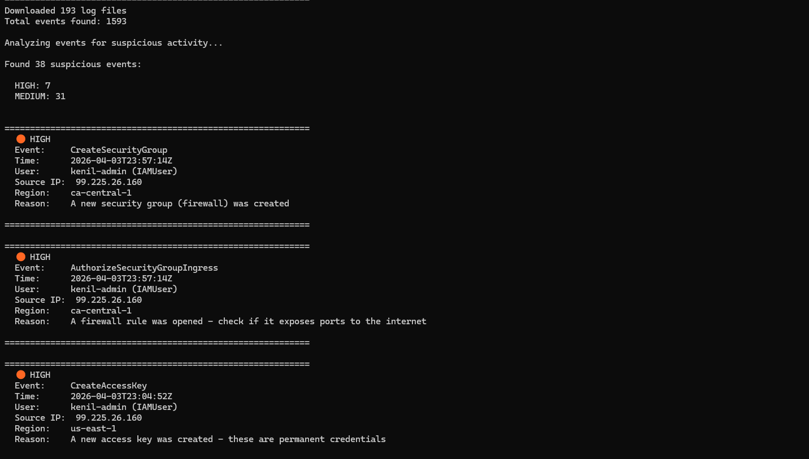
*CloudTrail analyzer detecting 38 suspicious events across 193 log files*

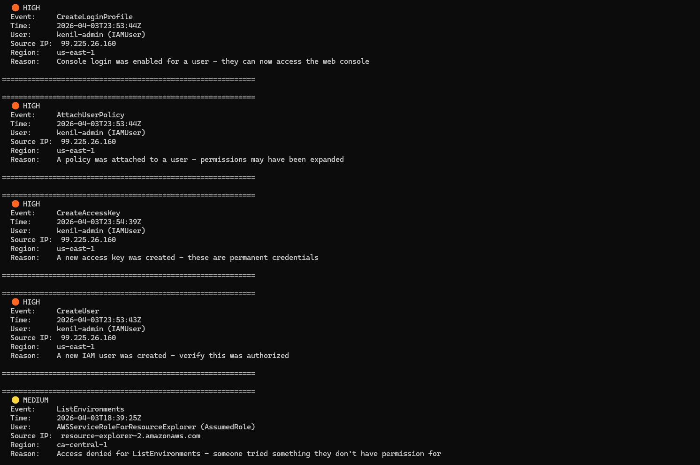
*HIGH severity alerts: CreateLoginProfile, AttachUserPolicy, CreateAccessKey, CreateUser*

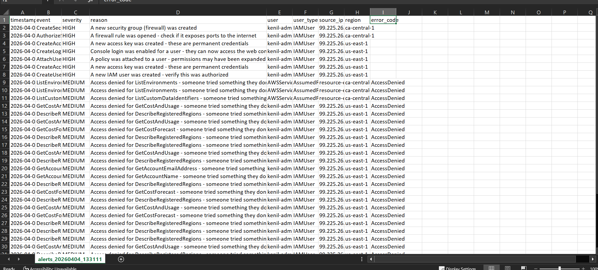
*Alert findings exported to CSV for further analysis*

---

### Week 2: GuardDuty + Automated Alerting

Event-driven pipeline: GuardDuty → EventBridge → Lambda → SNS → Email

The Lambda enrichment function extracts the attacker IP from each GuardDuty finding, queries a geolocation API for country, city, ISP, and organization data, and formats a clean alert before publishing to SNS.

**EventBridge rule pattern** — filters for medium severity and above:

```json
{
  "source": ["aws.guardduty"],
  "detail-type": ["GuardDuty Finding"],
  "detail": {
    "severity": [{"numeric": [">=", 4]}]
  }
}
```

**Pipeline stages demonstrated:**

| Stage | Before Lambda | After Lambda |
|-------|--------------|--------------|
| Alert format | Raw JSON blob | Formatted report with sections |
| Attacker info | IP address only | IP + country, city, ISP, org, AS number |
| Email subject | Generic "AWS Notification" | `[HIGH] GuardDuty: UnauthorizedAccess:EC2/SSHBruteForce` |

**Sample enriched alert output:**

```
==================================================
  GUARDDUTY SECURITY ALERT
==================================================

  Severity:    HIGH (8)
  Finding:     UnauthorizedAccess:EC2/SSHBruteForce
  Title:       EC2 instance is under SSH brute force attack
  Region:      ca-central-1
  Time:        2026-04-03T20:30:00Z
  Resource:    EC2 Instance: i-0abc123def456 (t2.micro)
  Attacker IP: 185.220.101.45

  --- Attacker Details ---
  Country:     Germany
  City:        Brandenburg, Brandenburg
  ISP:         Stiftung Erneuerbare Freiheit
  Org:         ForPrivacyNET
  AS Number:   AS60729 Stiftung Erneuerbare Freiheit

  --- Description ---
  EC2 instance i-0abc123def456 is being targeted by an
  SSH brute force attack from 185.220.101.45

==================================================
  Alert generated by AWS Security Lab
  2026-04-05 02:17:01 UTC
==================================================
```

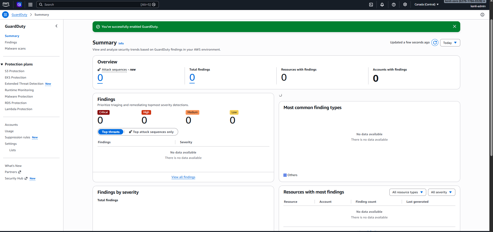
*GuardDuty successfully enabled in ca-central-1*

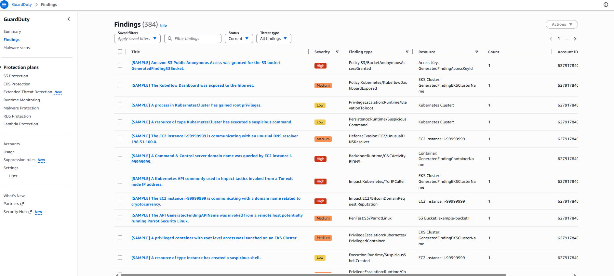
*384 sample findings generated across all severity levels*

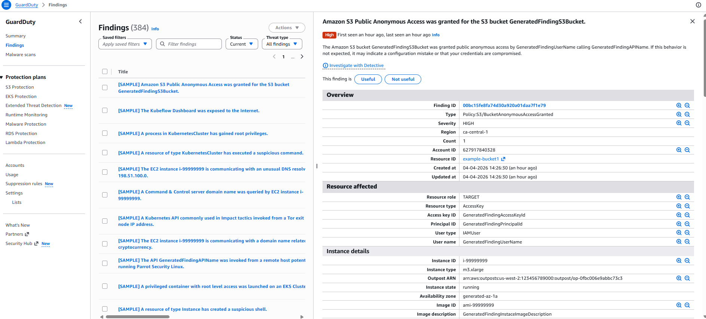
*Finding detail: S3 Public Anonymous Access — HIGH severity*

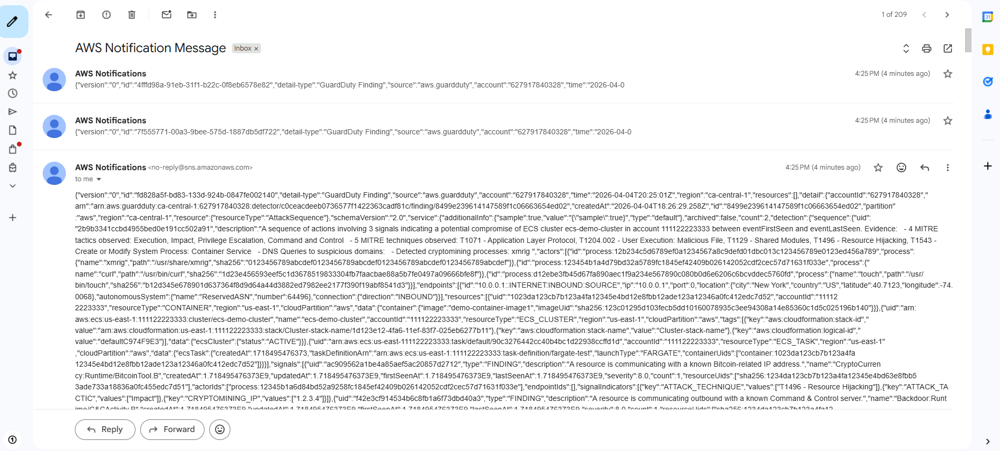
*Before Lambda enrichment: raw JSON alert emails*

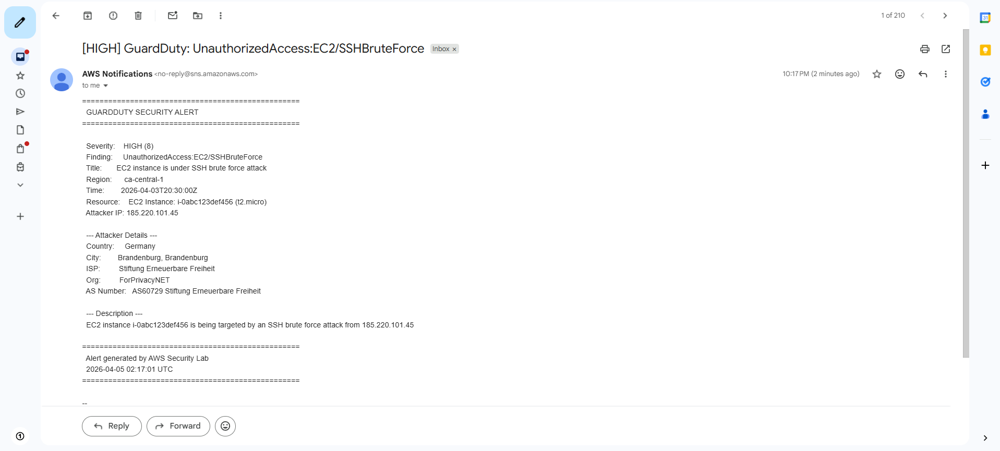
*After Lambda enrichment: formatted alert with attacker geolocation (Germany, Brandenburg, ForPrivacyNET)*

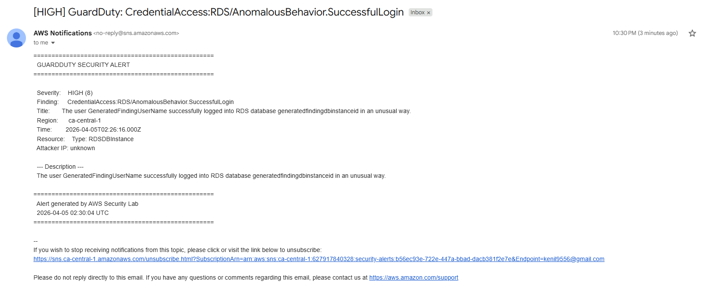
*Enriched alert: RDS anomalous login behavior detected*

---

### Week 3: Prowler CIS Compliance Scanning

Prowler v3.11.3 scan against CIS AWS Foundations Benchmark running on Kali Linux.

**Scan Results:**

| Metric | Value |
|--------|-------|
| Total checks | 187 |
| Passed | 95 |
| Failed | 88 |
| Compliance score | 51.9% |
| Critical findings | 1 |
| High findings | 7 |
| Medium findings | 64 |
| Low findings | 16 |

**Key findings detected:**
- **CRITICAL:** Root account access key exists
- **HIGH:** Security groups allow ingress from `0.0.0.0/0` to all ports
- **HIGH:** Default VPC security group allows traffic
- **HIGH:** GuardDuty high severity findings unaddressed
- **MEDIUM:** CloudWatch log metric filters missing for IAM changes, root usage, VPC changes
- **MEDIUM:** EBS default encryption not activated

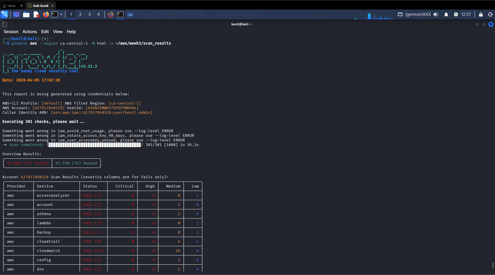
*Prowler executing 301 checks against AWS account from Kali Linux*

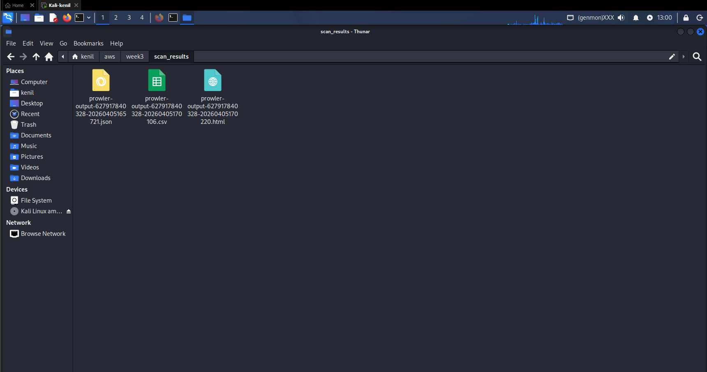
*Scan output in JSON, CSV, and HTML formats*

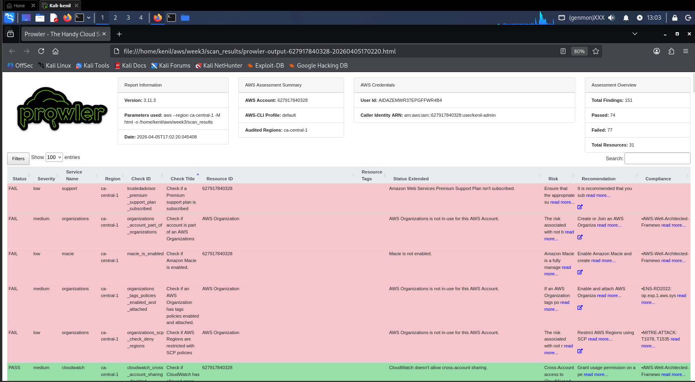
*Prowler's built-in HTML assessment report*

**Custom Security Posture Dashboard:**

Built a Python dashboard generator (`prowler_dashboard.py`) that parses Prowler JSON output and generates a professional HTML dashboard with compliance ring, severity distribution, service breakdown, and detailed finding cards with remediation guidance.

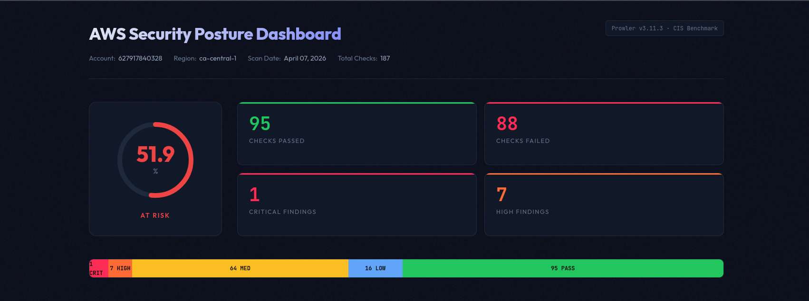
*Custom dashboard: 51.9% compliance score with severity breakdown*

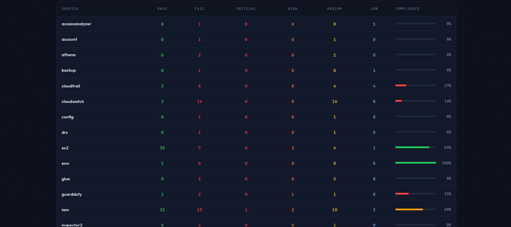
*Service breakdown: IAM at 68%, EC2 at 83%, CloudTrail at 27%, CloudWatch at 16%*

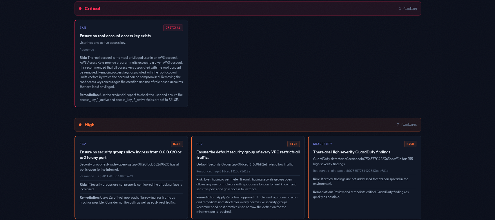
*Critical and High finding cards with risk context and remediation steps*

---

### Week 4: Security Hub Integration & Daily Digest

All three data sources unified in AWS Security Hub using ASFF (AWS Security Finding Format).

**Integration summary:**

| Source | Findings Imported | Method |
|--------|------------------|--------|
| GuardDuty | Automatic | Native integration |
| Prowler | Via `--send-sh-findings` flag | `BatchImportFindings` API |
| CloudTrail Analyzer | 94 custom alerts | Python import script |

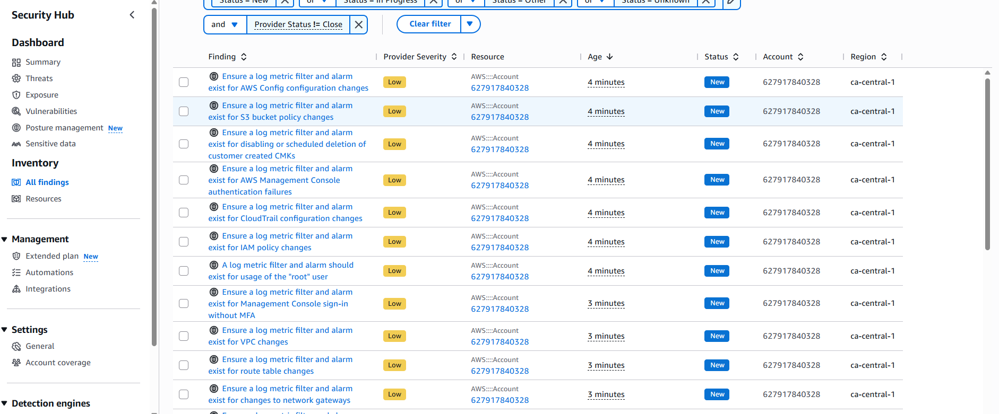
*Security Hub aggregating findings from multiple sources*

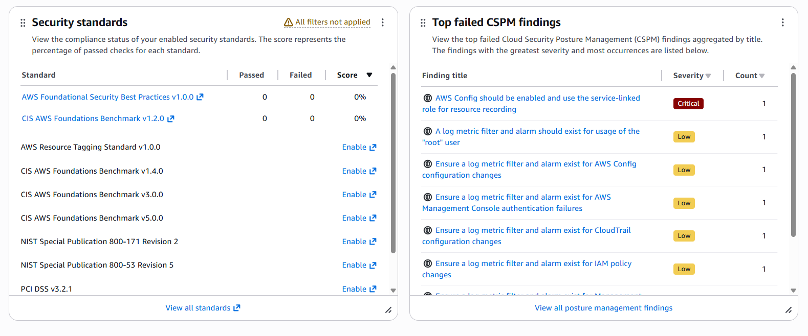
*Security standards enabled: AWS Foundational Security Best Practices + CIS Benchmark*

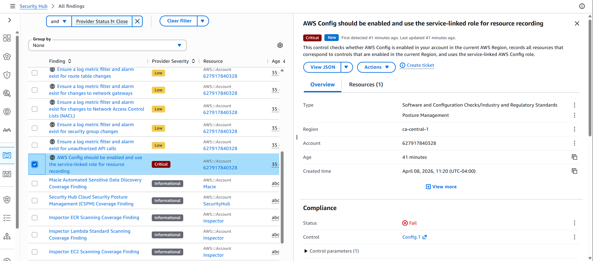
*Finding detail view with compliance status and remediation link*

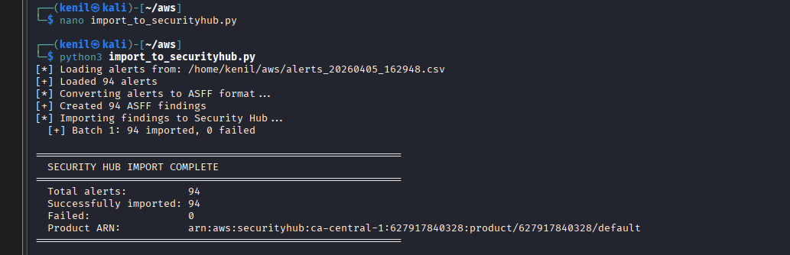
*Custom import script: 94 CloudTrail alerts successfully imported to Security Hub*

**Daily Digest Lambda:**

Scheduled Lambda function queries Security Hub every morning for critical/high findings from the last 24 hours and sends a formatted email summary.

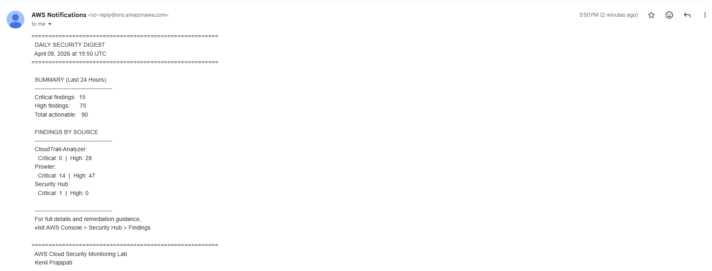
*Daily digest: 15 Critical, 75 High findings broken down by source (CloudTrail-Analyzer, Prowler, Security Hub)*

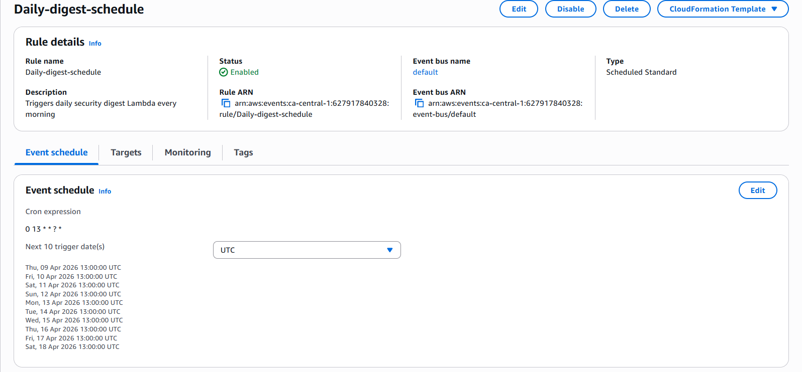
*EventBridge cron rule: triggers daily at 13:00 UTC (9AM EST)*

---

## Remediation Actions Taken

Findings weren't just detected — they were fixed. This table documents the remediation steps performed after the initial scan:

| Finding | Severity | Action Taken | Status |
|---------|----------|-------------|--------|
| Root account access key exists | CRITICAL | Deleted root access key, enforced console-only root with MFA | Resolved |
| Security group open to `0.0.0.0/0` on all ports | HIGH | Deleted `test-wide-open-sg`, restricted SSH to specific admin IPs | Resolved |
| Default VPC security group allows all traffic | HIGH | Modified default SG to deny all inbound, restrict outbound | Resolved |
| Backdoor IAM user with admin access | HIGH | Deleted user, revoked access key, audited IAM policy attachments | Resolved |
| Public S3 bucket | HIGH | Deleted bucket, re-enabled Block Public Access on account level | Resolved |
| CloudWatch log metric filters missing (16 checks) | MEDIUM | Documented as future enhancement — requires CloudWatch alarms setup | Planned |
| EBS default encryption not activated | MEDIUM | Enabled default EBS encryption in ca-central-1 | Resolved |
| CloudTrail log group not KMS encrypted | MEDIUM | Documented as future enhancement — requires KMS CMK setup | Planned |

---

## Tech Stack

| Category | Tools |
|----------|-------|
| Cloud Platform | AWS (ca-central-1) |
| Security Services | CloudTrail, GuardDuty, Security Hub |
| Compute | Lambda (Python 3.12), EventBridge |
| Storage | S3 |
| Notifications | SNS |
| Scanning | Prowler v3.11.3 (CIS AWS Foundations Benchmark v1.4) |
| Languages | Python 3 |
| Libraries | Boto3, pandas, Jinja2, urllib |
| Environment | Windows 11, Kali Linux (VMware) |
| Compliance | CIS AWS Foundations Benchmark, ASFF, MITRE ATT&CK |

---

## Project Structure

```
aws-cloud-security-lab/
├── week1/
│   ├── cloudtrail_analyzer.py          # CloudTrail log analysis script
│   └── sample_output/
│       └── alerts_20260404_133111.csv   # Sample alert output
├── week2/
│   ├── lambda_enricher.py              # GuardDuty enrichment Lambda
│   ├── eventbridge_rule.json           # EventBridge event pattern
│   └── test_event.json                 # Sample GuardDuty test event
├── week3/
│   ├── prowler_dashboard.py            # Custom HTML dashboard generator
│   ├── prowler_dashboard.html          # Generated dashboard
│   └── scan_results/
│       ├── prowler-output-*.json       # Raw scan results
│       ├── prowler-output-*.csv        # CSV export
│       └── prowler-output-*.html       # Prowler built-in report
├── week4/
│   ├── import_to_securityhub.py        # ASFF import script
│   ├── daily_digest_lambda.py          # Daily digest Lambda function
│   └── eventbridge_schedule.json       # Cron schedule configuration
├── AWS-ss/                             # All project screenshots
└── README.md
```

---

## Setup & Replication

### Prerequisites

- AWS Account (Free Tier eligible)
- Python 3.10+
- AWS CLI configured with admin credentials
- Prowler v3.11.3+ (`pip install prowler`)
- Boto3 and pandas (`pip install boto3 pandas jinja2`)

### Quick Start

**1. CloudTrail Analyzer**
```bash
# Update BUCKET_NAME and ACCOUNT_ID in the script
cd week1
python cloudtrail_analyzer.py
```

**2. GuardDuty Alerting**
```
Enable GuardDuty → Create SNS topic → Deploy lambda_enricher.py to Lambda
→ Create EventBridge rule with eventbridge_rule.json → Target: Lambda function
```

**3. Prowler Scan**
```bash
prowler aws --region ca-central-1 --output-formats json-ocsf csv html --output-directory week3/scan_results
cd week3
python prowler_dashboard.py
```

**4. Security Hub Integration**
```bash
# Enable Security Hub in console
# Import Prowler findings
prowler aws --region ca-central-1 --send-sh-findings

# Import CloudTrail alerts
cd week4
python import_to_securityhub.py
```

---

## Key Learnings

**Cloud Security Fundamentals** — Hands-on experience with the three pillars of cloud security: prevention (IAM policies, least privilege), detection (GuardDuty ML-based threat detection, CloudTrail audit logging), and compliance (CIS Benchmarks, security posture assessment).

**Event-Driven Architecture** — Built a real-time alerting pipeline using EventBridge event patterns, Lambda serverless functions, and SNS pub/sub messaging. Learned how AWS services communicate asynchronously through events.

**Security Data Engineering** — Parsed and normalized security findings from three different sources (CloudTrail JSON logs, GuardDuty findings, Prowler JSON output) into a unified ASFF format for centralized analysis in Security Hub.

**Detection Engineering** — Wrote custom detection rules for six categories of suspicious activity mapped to MITRE ATT&CK framework. Learned the difference between high-fidelity alerts (StopLogging = always suspicious) and noisy alerts (AccessDenied from AWS internal services = usually benign).

**Compliance & Reporting** — Ran CIS AWS Foundations Benchmark checks, interpreted results, performed remediation, and built executive-level visual dashboards that translate technical findings into actionable compliance scores.

---

## How This Maps to Job Roles

| Skill Demonstrated | Relevant Roles |
|-------------------|----------------|
| CloudTrail log analysis, custom detection rules, MITRE ATT&CK mapping | SOC Analyst, Detection Engineer |
| GuardDuty + Lambda enrichment pipeline, real-time alerting | Cloud Security Engineer, SecOps |
| CIS Benchmark scanning, compliance dashboard, executive reporting | GRC Analyst, Vulnerability Management |
| Security Hub aggregation, ASFF normalization, multi-source correlation | Security Architect, CSPM Engineer |
| Python/Boto3 automation, serverless functions, event-driven design | Security Automation Engineer |
| Remediation documentation, risk assessment, posture improvement | Cloud Security Analyst, Risk Analyst |

---

## Future Enhancements

- **Slack webhook integration** for daily digest delivery to a security team channel
- **CloudWatch metric filters and alarms** for CIS Section 3 compliance (log-based monitoring)
- **Automated remediation Lambda** that auto-revokes public S3 bucket access and closes open security groups
- **Terraform/CloudFormation IaC templates** for full pipeline deployment as infrastructure-as-code
- **MITRE ATT&CK heatmap** visualization showing coverage across tactics and techniques
- **Multi-account support** via AWS Organizations for enterprise-scale monitoring
- **Custom Prowler checks** for organization-specific security policies beyond CIS
- **Integration with SIEM** (Splunk/Sentinel) via S3 export or direct API forwarding

---

## Cost

Everything runs on AWS Free Tier. GuardDuty has a 30-day free trial, Lambda provides 1M free requests/month, and S3 storage costs were under $0.10. Total project cost: **< $5 CAD**.

---

## License

MIT License — see [LICENSE](LICENSE) for details.

---

## Contact

**Kenil Prajapati**
- Program: Cybersecurity & Threat Management — Seneca Polytechnic (Graduating August 2025)
- Certifications: ISC2 CC, AWS Academy Cloud Security Foundations
- LinkedIn: [Connect with me](https://www.linkedin.com/in/kenilkumar-prajapati/)
- GitHub: [github.com/kenil-p](https://github.com/kenil-p)
